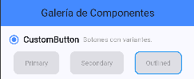
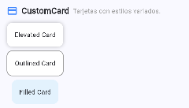
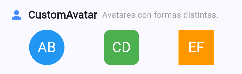
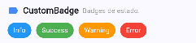
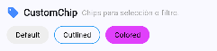
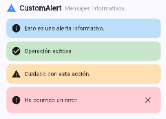
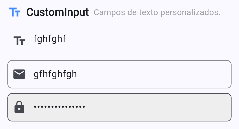
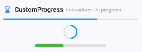

# Galería de Componentes Flutter

## Datos del Proyecto

| Dato | Información |
|------|--------------|
| **Alumno:** | *Ana Jael Santos Carbajal* |
| **Matrícula:** | *I20223TN110* |
| **Materia:** | Desarrollo Móvil Integral |
| **Práctica:** | Práctica 1 — Galería de Componentes |
| **Fecha:** | *No definida* |
| **Versión de Flutter:** | *Flutter 3.35.7* |

## Descripción del Proyecto

Esta aplicación Flutter muestra una **galería interactiva de componentes personalizados**, desarrollados sin utilizar librerías externas.  
Cada componente fue diseñado como un `StatelessWidget`, aplicando principios de diseño, estilos con `BoxDecoration`, `TextStyle`, `EdgeInsets`, `BorderRadius`, y uso de `Enums` para definir sus variantes.

El objetivo es **dominar la creación de componentes reutilizables**, organizados visualmente en una sola pantalla para su comparación y análisis.

## Estructura del Proyecto

lib/
├── components/
│ ├── custom_button.dart
│ ├── custom_card.dart
│ ├── custom_avatar.dart
│ ├── custom_badge.dart
│ ├── custom_chip.dart
│ ├── custom_alert.dart
│ ├── custom_input.dart
│ └── custom_progress.dart
├── screens/
│ └── gallery_screen.dart
└── main.dart

## Componentes Implementados

| # | Componente | Variantes | Descripción |
|---|-------------|-----------|-------------|
| 1 | **CustomButton** | Primary, Secondary, Outlined | Botones personalizados con distintos estilos |
| 2 | **CustomCard** | Elevated, Outlined, Filled | Tarjetas contenedoras con borde, sombra o fondo |
| 3 | **CustomAvatar** | Circular, Rounded, Square | Avatares con formas diferentes y colores |
| 4 | **CustomBadge** | Info, Success, Warning, Error | Etiquetas de estado con colores según tipo |
| 5 | **CustomChip** | Default, Outlined, Colored | Chips con opción de selección y eliminación |
| 6 | **CustomAlert** | Info, Success, Warning, Error | Alertas con fondo e iconos representativos |
| 7 | **CustomInput** | Standard, Outlined, Filled | Campos de texto personalizados |
| 8 | **CustomProgress** | Linear, Circular, Custom | Indicadores de progreso personalizables |

---

## Pantalla Principal

La pantalla principal (`GalleryScreen`) organiza todos los componentes dentro de una lista con scroll vertical, donde cada sección contiene:

- Ícono y nombre del componente  
- Descripción breve  
- Ejemplos de sus variantes  
- Separación clara entre secciones  

## Capturas de Pantalla

A continuación se muestran ejemplos visuales de los componentes desarrollados:

| Componente | Captura |
|-------------|----------|
| **CustomButton** |  |
| **CustomCard** |  |
| **CustomAvatar** |  |
| **CustomBadge** |  |
| **CustomChip** |  |
| **CustomAlert** |  |
| **CustomInput** |  |
| **CustomProgress** |  |

## Instrucciones para Ejecutar

1. Clona el repositorio:
   ```bash
   git clone https://github.com/JaelSantos01/component_gallery.git
   cd component_gallery
2. Instalar dependencias:
   ```bash
   flutter pub get
3. Ejecuta la app:
   ```bash
   flutter run

